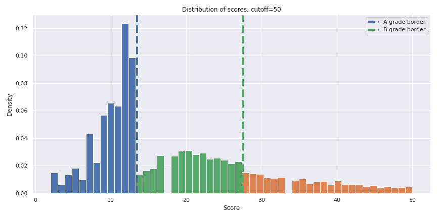

# Identifying and Analyzing Patterns in NYC Restaurant Inspections 

I was interested in working with NYC restaurant-related data. I have personal family connections to the NYC restaurant biz and I also wanted to look for  and the overall diverse demographics that make up the five boroughs of New York.

I perform exploratory data analysis to try and identify trends in grading and scoring across geographical boundaries. I also look at 

## Data Sources

1. Official dataset from the NYC Department of Health on every health inspection result for all restaurants in the city. [Link](https://data.cityofnewyork.us/Health/DOHMH-New-York-City-Restaurant-Inspection-Results/43nn-pn8j)
2. Python package `uszipcode` for gathering NYC median income data [Link](https://pypi.org/project/uszipcode/)

## Background Information

* In 2019, NYC's restaurant industry consisted of 24,000 restaurants and 317,000 jobs -- both of these numbers were all time highs. Further, the growth rate of the restaurant industry in the preceding 10-year timeframe doubled the growth rate of overall city businesses.
 * The pandemic in 2020 drastically changed, along with many other things, the size of the restaurant industry in NYC. This project will only look at data in the completed calendar years __2017-2019__. 
* The DoH conducts health inspections of every one of these establishments on a regular cycle, giving a certain number of points for each sanitary violation found:
 * "A" grade: 0-13 points
 * "B" grade: 14-27 points
 * "C" grade: 28 or more points

## Exploratory Data Analysis

Early EDA on the counts of grades and grade distributions across boroughs:

 

Distribution of scores:

By cuisine type:
!