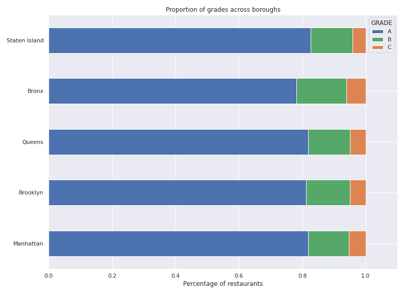

# Identifying and Analyzing Patterns in NYC Restaurant Inspections 

I was interested in working with NYC restaurant-related data. I have personal family connections to the NYC restaurant biz and I also wanted to look for  and the overall diverse demographics that make up the five boroughs of New York.

I perform exploratory data analysis to try and identify trends in grading and scoring across geographical boundaries. I also look at 

## Data Sources

1. Official dataset from the NYC Department of Health on every health inspection result for all restaurants in the city. [Link](https://data.cityofnewyork.us/Health/DOHMH-New-York-City-Restaurant-Inspection-Results/43nn-pn8j)
2. Python package `uszipcode` for gathering NYC median income data [Link](https://pypi.org/project/uszipcode/)

## Background Information

* In 2019, NYC's restaurant industry consisted of 24,000 restaurants and 317,000 jobs -- both of these numbers were all time highs. Further, the growth rate of the restaurant industry in the preceding 10-year timeframe doubled the growth rate of overall city businesses.
 * The pandemic in 2020 drastically changed, along with many other things, the size of the restaurant industry in NYC. This project will only look at data in the completed calendar years __2017-2019__. 
* The DoH conducts health inspections of every one of these establishments on a regular cycle, giving a certain number of points for each sanitary violation found:
 * "A" grade: 0-13 points
 * "B" grade: 14-27 points
 * "C" grade: 28 or more points

## Exploratory Data Analysis

I first performed early EDA on the counts of grades and grade distributions across boroughs. I broke down how the numerical scores were distributed, and also took the top 10 cuisine types in the dataset, and looked at the proportion of grades distributed.

 

Distribution of scores:

By cuisine type:

We can see that there is a distinct drop-off in proportion of A-graded restaurants when comparing American and Italian cuisine to Chinese/Spanish/Caribbean.

## Incorporating Median Income of Zip Code

I try to see if there is a relationship between the overall wealth of a neighborhood (as measured by median income) and the rate of health grades of its restaurants. To do this, I introduce new data that contains measurements of median income for all NYC postal codes - of which there are roughly ~160. 

We see a small, but observable difference in the median incomes for A-graded restaurants to B and C-graded restaurants. We now perform a statistical hypothesis test to see if the difference observed is indeed statistically significant. 

### Hypothesis Testing

Method: Mann-Whitney U-test. [See income_htest notebook for details on p-value calculation](notebooks/income_test.ipynb)

### Linear Regression Model

I create a simple linear regression model relating the median income of a postal code, and the percentage of A-graded restaurants in that zip code. 

I obtained a p-value of 0.009 and an R-squared of 0.090. There appears to be a weak positive correlation between these two metrics of a given NYC zip code. 

## Geo-plotting with Folium

Due to the availability of lat-long coordinates for every restaurant in the dataset, along with zip-code data, I used both choropleth maps and heat maps available in the Folium python package to geographically plot the data.

Choropleth map showing percentage of A graded restaurants per zip code

Choropleth map showing median income of zip code

Heat map of where restaurant violations are cited using lat-long coordinates

## Further Work

* Obtain Yelp price point data for each restaurant

* Incorporate ethnic demographic numbers for neighborhoods of New York

* Create composite map of Percentage A vs. Income map. This would make it easier to read and provide better information at a glance.